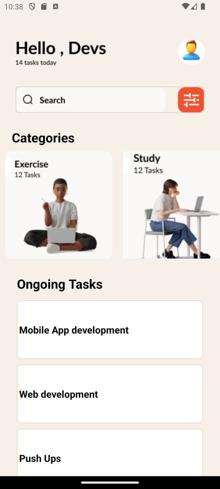

A brief description of the components i used:
a. Stylesheet: this helps in defining the appearance and layout of the user interface elements.

b. Text: this is used to display text in the application.

c. Image: this is used to display images in the application.

d. ScrollView: this component is a scrollable container that can host multiple components and views which allows for vertical and horizontal scrolling and is useful for displaying content that is larger than the visible area of the screen.

e. View: this serves as a container that can hold other components and you can style it to arrange and position its child components.

f. FlatList: this component is used to render large lists of data efficiently.

**Screenshot**

